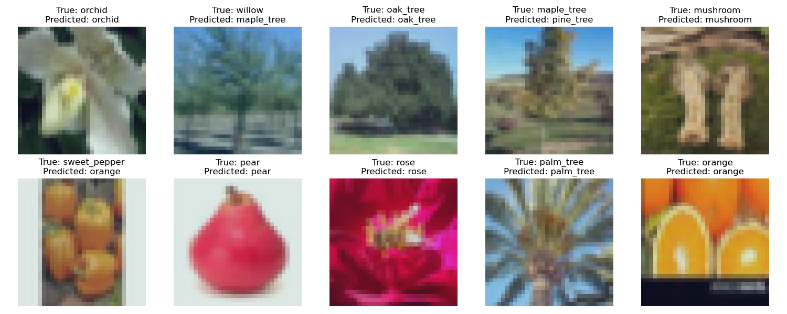
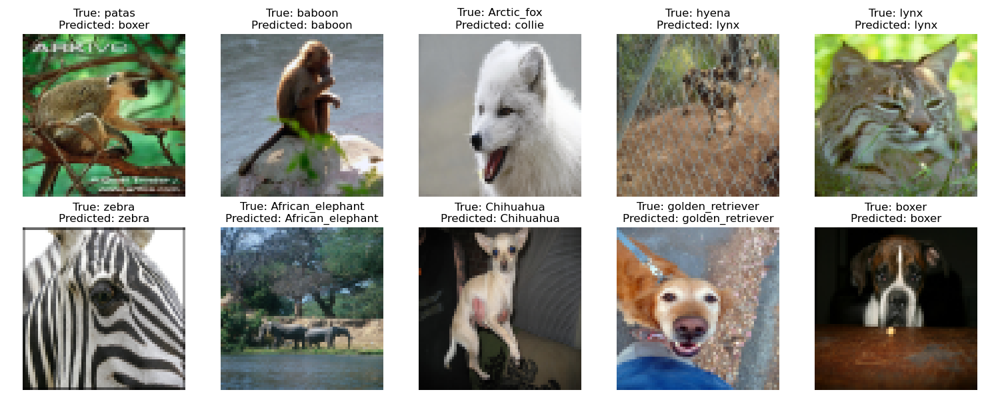

# Mixture of Experts (MoE) Training Framework

This repository contains a training framework for Mixture of Experts (MoE) models designed for multi-task learning.

## Clone the Project

``` bash
# Clone the project
git clone git@github.com:Djanghao/cas771-moe.git

# Change the directory to the root
cd cas771-moe

# Initialize submodules
git submodule update --init --recursive
```

## Download Required Resources

Before running the evaluation, download the model and data files:

```bash
# Download best models
gdown --fuzzy https://drive.google.com/file/d/1GQmdfksDEUIoxiJAMBYRZ-oZw0Pa0F8c

# Download data
gdown --fuzzy https://drive.google.com/file/d/12KVxl9n577vwoZ1WPn6U70jD37_UA0y-


# Extract downloaded files
for file in *.zip; do unzip "$file"; done && find . -type d -name "__MACOSX" -exec rm -rf {} \; 2>/dev/null
```

## Quick Start: Model Evaluation

To evaluate both Task A and Task B models and view the results:

```bash
python evaluation.py
```

This will:
1. Run evaluation for both Task A and Task B models
2. Display performance metrics including overall accuracy and per-class accuracy
3. Show sample predictions with expert gate contributions
4. Automatically open visualization images showing:
   - Sample predictions with randomly selected classes
   - Expert analysis showing specialization patterns

The evaluation script randomly selects 10 classes for visualization to ensure diverse representation of model performance.

### Sample Visualizations

#### Task A: 


#### Task B


## Features

- Automatic experiment management with timestamped directories
- Regular updates to learning curves (every 10 epochs)
- Comprehensive expert analysis and visualization
- Command-line argument support for flexible training configuration
- Dynamic temperature scaling and balanced expert initialization
- Advanced loss functions with diversity and balance penalties

## Model Architecture

The architecture consists of several key components working together to form a Mixture of Experts (MoE) system:

### Feature Extractor
- Convolutional neural network that extracts features from input data
- Shared across all experts to provide a common representation
- Structure:
  - ConvBlock(3→64): Convolution + BatchNorm + ReLU
  - ResidualBlock(64→128): Residual connection with conv layers
  - MaxPool2d(2): Spatial downsampling
  - ResidualBlock(128→256): Deeper residual block with 2 conv layers
  - MaxPool2d(2): Further spatial downsampling
  - ConvBlock(256→512): 1x1 convolution for channel projection
- Initialized by averaging parameters from pretrained models

### Expert Networks (default: 3)
- Specialized networks that process features from the feature extractor
- Each expert can specialize in different aspects of the task or different subsets of data
- Structure per expert:
  - Depthwise Convolution: Conv2d(512→512, kernel=3, groups=512)
  - Pointwise Convolution: Conv2d(512→512, kernel=1)
  - BatchNorm2d(512)
  - ReLU activation
  - Dropout(0.5)
  - AdaptiveAvgPool2d((1, 1))
  - Flatten()
  - Dropout(0.5)
- Expert outputs are combined based on gating network weights

### Gating Network
- Determines which experts to use for each input sample
- Produces both a weight distribution over experts AND additional features
- Two parallel paths:
  1. Feature generation network:
     - Linear(512→256)
     - BatchNorm1d(256)
     - ReLU
     - Dropout(0.2)
     - Linear(256→256)
     - BatchNorm1d(256)
     - ReLU
  2. Gating weight network:
     - Linear(512→256)
     - BatchNorm1d(256)
     - ReLU
     - Dropout(0.2)
     - Linear(256→num_experts)
     - Temperature-scaled softmax
- Training noise added to gating logits to prevent getting stuck in local optima
- Uses temperature-scaled softmax for controlling the "softness" of expert selection

### Feature Combination and Classification
- Expert features (512-dim each) are weighted by gating outputs and combined
- Gating features (256-dim) are concatenated with combined expert features
- Final unified classifier: Linear(768→num_classes)
- Returns both class predictions and expert gating weights

## Parameters

### Basic Training Parameters
- `--num_epochs`: Number of training epochs (default: 100)
- `--lr`: Learning rate for optimizer (default: 0.001)
- `--weight_decay`: Weight decay for regularization (default: 1e-4)
- `--patience`: Epochs to wait before early stopping (default: 20)
- `--batch_size`: Batch size for training (default: 32)
- `--seed`: Random seed for reproducibility (default: 100)
- `--model_name`: Name prefix for saved model (default: "merged_moe")
- `--expert_analysis_interval`: How often to save expert analysis visualizations (default: 10)

### MoE Specific Parameters

#### Diversity and Balance Control
- `--diversity_weight`: Controls the diversity of expert specialization (range: 0.05-0.2, default: 0.1)
  - Higher values (>0.2) encourage more diverse expert utilization but may reduce accuracy
  - Lower values (<0.05) allow experts to specialize more aggressively but may lead to expert collapse
  - Increase if experts show similar patterns in contribution plots
  - Decrease if overall accuracy is significantly impacted

- `--balance_weight`: Controls load balancing between experts (range: 0.3-1.0, default: 0.5)
  - Higher values (>0.5) enforce more equal expert utilization (important for distributed systems)
  - Lower values (<0.2) allow more uneven expert usage (may improve performance on imbalanced datasets)
  - Increase if one expert dominates and handles most classes
  - Decrease if experts show too much overlap in their specialization

#### Temperature Parameters
- `--initial_temperature`: Starting temperature for gating network (range: 1.5-4.0, default: 2.0)
  - Higher values (>2.0) ensure all experts are utilized early in training
  - Important to prevent early expert collapse

- `--final_temperature`: Final temperature for gating network (range: 0.3-1.0, default: 0.5)
  - Lower values (<0.5) create more specialized experts
  - Higher values (>1.0) keep expert selection soft (useful for uncertain inputs)
  - Set closer to initial_temperature for more consistent training

## Loss Functions

The training process utilizes several loss components that are combined to guide the model toward effective expert specialization:

### 1. Primary Task Loss
The standard cross-entropy loss for classification:

$L_{task} = -\sum_{i=1}^{N} \sum_{c=1}^{C} y_{i,c} \log(p_{i,c})$

Where:
- $N$ is the batch size
- $C$ is the number of classes
- $y_{i,c}$ is the ground truth (1 if sample $i$ belongs to class $c$, 0 otherwise)
- $p_{i,c}$ is the model's predicted probability that sample $i$ belongs to class $c$

### 2. Diversity Loss
Encourages experts to specialize in different parts of the input space:

$L_{diversity} = \sum_{i=1}^{N} \sum_{j=1}^{E} \sum_{k=1}^{E} G_{i,j} \cdot G_{i,k} \cdot (j \neq k)$

Where:
- $E$ is the number of experts
- $G_{i,j}$ is the gating value (weight) for expert $j$ on input sample $i$
- This loss penalizes when multiple experts are heavily weighted for the same input

### 3. Balance Loss
Ensures that experts are used approximately equally across the batch:

$L_{balance} = \sum_{j=1}^{E} \left(\frac{1}{E} - \frac{1}{N}\sum_{i=1}^{N} G_{i,j}\right)^2$

Where:
- This loss penalizes deviation from uniform utilization ($\frac{1}{E}$) of experts

### Combined Loss
The final loss is a weighted combination of the three components:

$L_{total} = L_{task} + \lambda_{diversity} \cdot L_{diversity} + \lambda_{balance} \cdot L_{balance}$

Where:
- $\lambda_{diversity}$ is the diversity weight parameter
- $\lambda_{balance}$ is the balance weight parameter

## Temperature Annealing

The gating network uses a temperature parameter that controls how "soft" or "hard" the expert selection is:

$G_{i,j} = \frac{\exp(z_{i,j}/T)}{\sum_{k=1}^{E} \exp(z_{i,k}/T)}$

Where:
- $z_{i,j}$ is the raw logit (pre-softmax) value for expert $j$ on input $i$
- $T$ is the temperature parameter

The temperature is annealed during training from $T_{initial}$ to $T_{final}$ using a cosine schedule:

$T_t = T_{final} + 0.5 \cdot (T_{initial} - T_{final}) \cdot (1 + \cos(\pi \cdot t / epochs))$

Where:
- $t$ is the current epoch
- $epochs$ is the total number of training epochs

## Training Process

1. **Initialization**:
   - The model is initialized with a shared feature extractor and multiple experts
   - Feature extractor is initialized by averaging parameters from pretrained models
   - Expert networks are initialized from corresponding layers of pretrained models
   - The gating network begins with a high temperature to encourage exploration

2. **Forward Pass**:
   - Input data is processed by the shared feature extractor
   - The gating network assigns weights to each expert and generates additional features
   - Each expert processes the extracted features and produces expert-specific features
   - Expert features are weighted by gating outputs and combined
   - Gating features are concatenated with the combined expert features
   - Final classifier produces class predictions from the concatenated features

3. **Loss Calculation**:
   - Task loss (cross-entropy) is calculated based on prediction accuracy
   - Diversity loss is calculated to encourage specialization
   - Balance loss is calculated to ensure all experts are utilized
   - Losses are combined with appropriate weighting

4. **Backward Pass**:
   - Gradients are computed for the combined loss
   - Model parameters are updated using the Adam optimizer

5. **Temperature Annealing**:
   - Gating temperature is reduced over time according to a cosine schedule
   - This gradually transitions from exploration to exploitation

6. **Monitoring and Analysis**:
   - Expert analysis is performed at specified intervals
   - Visualizations show which experts specialize in which classes
   - Learning curves track overall model performance

7. **Early Stopping**:
   - Training stops if validation performance doesn't improve for a specified number of epochs
   - Best model weights are saved based on validation accuracy

## Expert Analysis

At specified intervals during training, expert analysis is performed to visualize specialization:

1. **Expert Accuracy**: Shows how well each expert performs on each class
2. **Expert Contribution**: Shows how much each expert contributes to predictions for each class

These visualizations help understand how experts are specializing and whether the diversity and balance parameters need adjustment.

## Usage

Run the training script with desired parameters:

```bash
# Basic usage with default parameters
python main.py --num_epochs 10 --expert_analysis_interval 10
